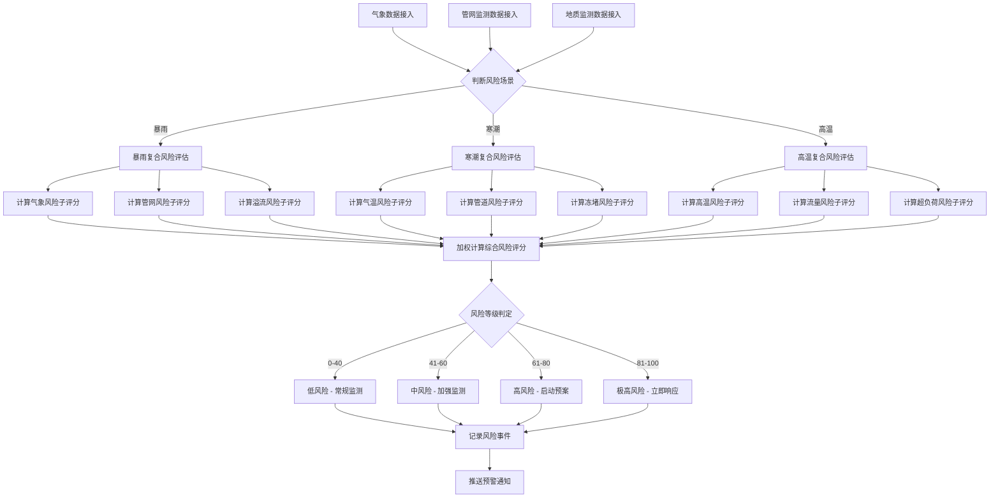
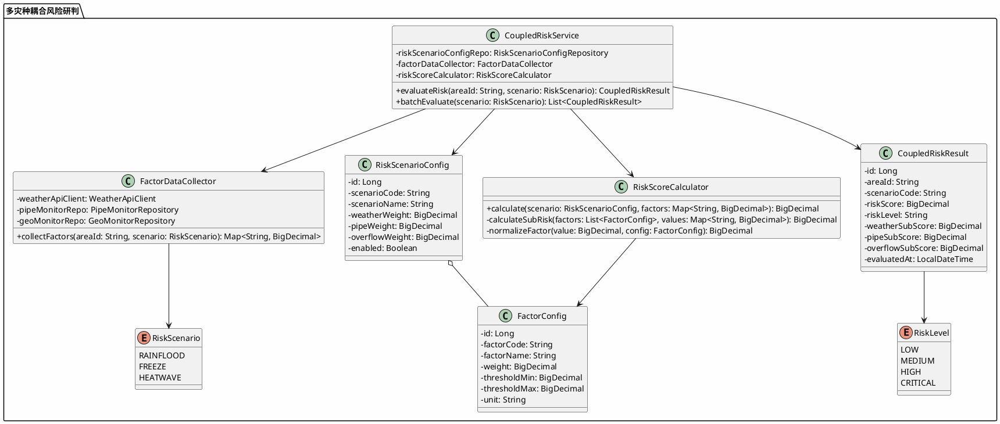
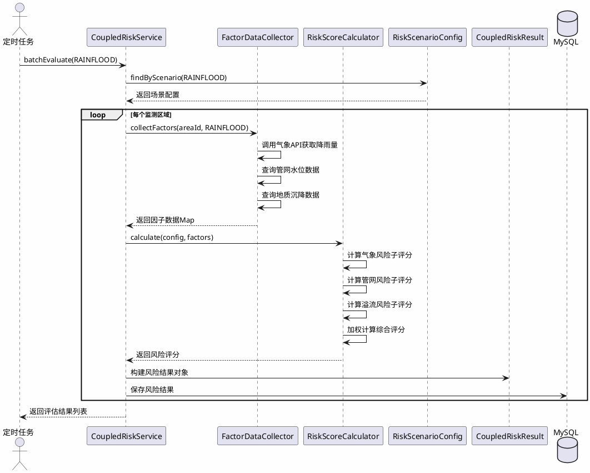
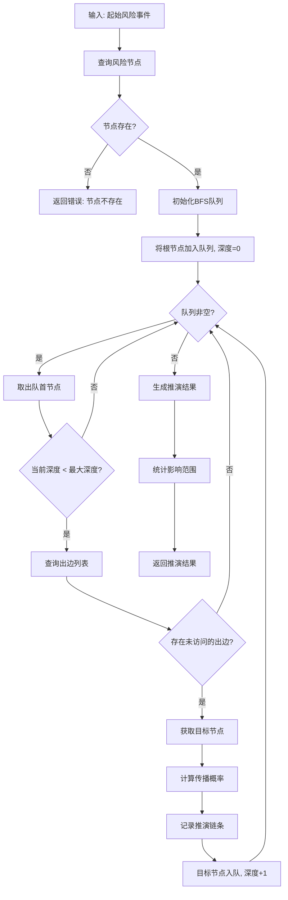
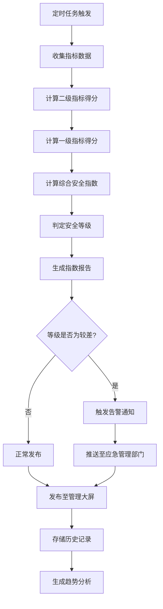
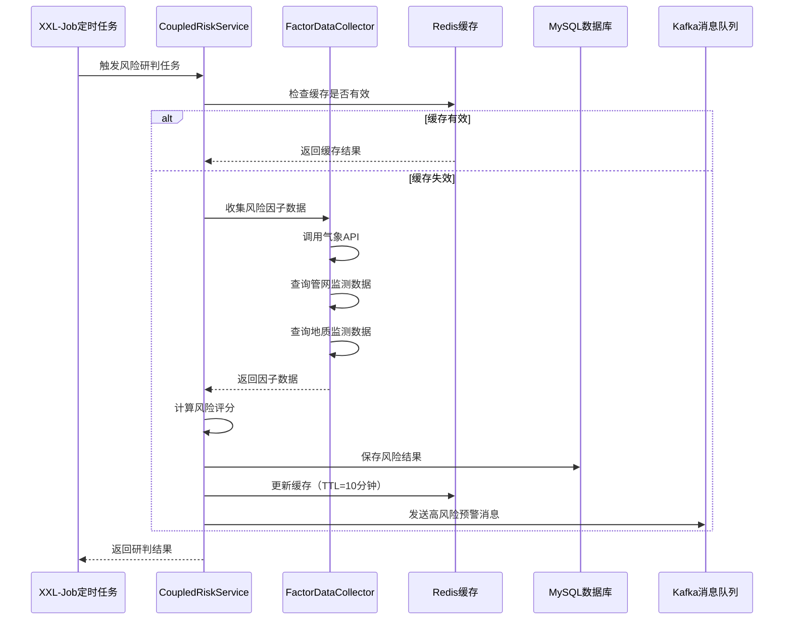

# 多灾种耦合风险研判子模块设计文档

> 版本：v1.0
> 更新日期：2026-09-01
> 适用范围：alarm-warning-service（风险研判引擎）
> 所属章节：4.3 多灾种耦合风险研判子模块

---

## 4.3.1 模块概述

### 建设背景

城市地下管网系统面临暴雨内涝、燃气泄漏、温度异常、地质沉降等多种灾害威胁。现有预警体系以单一灾种独立分析为主，缺乏跨系统、跨灾种的风险关联能力。当多种灾害同时或相继发生时，单一分析模型无法准确评估复合风险的真实影响，导致应急决策滞后、资源调度失当。

### 建设目标

| 目标 | 说明 |
|---|---|
| 解决单一灾害分析能力不足 | 构建多灾种耦合分析模型，实现跨灾种风险关联评估 |
| 实现跨系统风险关联分析 | 打通管廊监测、燃气风险、气象数据等多源信息，形成统一风险视图 |
| 提供城市级综合风险态势感知 | 构建城市安全指数体系，量化评估整体安全水平 |
| 为应急指挥决策提供支撑 | 通过灾害链推演和风险画像，辅助制定应急预案和资源调度方案 |

### 模块职责

| 职责 | 说明 |
|---|---|
| 多灾种耦合分析 | 综合气象、管网、地质等多源数据，计算复合风险评分 |
| 灾害链推演 | 基于图结构模型推演次生灾害传播路径和影响范围 |
| 重点区域风险画像 | 对学校、医院、商圈等重点区域构建多维度风险画像 |
| 城市安全指数 | 构建多级指标体系，定期计算并发布城市管网安全指数 |

### 业务价值

1. **提升预警精度**：从单一指标预警升级为多因子耦合预警，降低误报率和漏报率
2. **增强决策支撑**：灾害链推演为应急指挥提供"如果...那么..."的预判能力
3. **优化资源配置**：风险画像帮助管理者识别高风险区域，优先配置监测和应急资源
4. **量化安全水平**：城市安全指数为管理层提供直观、可比较的安全评估指标

### 应用场景

| 场景 | 描述 | 涉及模块 |
|---|---|---|
| 暴雨季管网防汛 | 暴雨预警触发后，自动评估管网溢流、道路塌陷的复合风险 | 极端天气复合风险研判 |
| 寒潮期间管道防冻 | 寒潮来临前，推演管道冻堵→爆管→供水中断的灾害链 | 次生灾害推演分析 |
| 重点区域安全评估 | 开学季前对学校周边管网进行全面风险画像 | 重点区域风险画像 |
| 城市安全月报 | 每月自动生成城市管网安全指数报告 | 城市管网安全指数 |

---

## 4.3.2 极端天气复合风险研判

### 风险链定义

本模块定义以下三种典型极端天气复合风险链：

#### 场景1：暴雨 → 管网溢流 → 道路塌陷

```
暴雨（气象数据）
  ↓ 降雨量 > 阈值
管网水位骤升（管网监测数据）
  ↓ 水位 > 溢流阈值
管网溢流（预警事件）
  ↓ 持续溢流 > 2小时
路基冲刷 → 道路塌陷（地质监测数据）
```

#### 场景2：寒潮 → 管道冻堵 → 爆管

```
寒潮（气象数据）
  ↓ 气温 < -10℃ 持续 24h
管道温度骤降（管网监测数据）
  ↓ 管壁温度 < 0℃
管道冻堵（预警事件）
  ↓ 压力异常升高
管道爆裂（压力监测数据）
```

#### 场景3：高温 → 用水激增 → 管网超负荷

```
高温（气象数据）
  ↓ 气温 > 35℃ 持续 3天
用水量激增（流量监测数据）
  ↓ 流量 > 设计容量 80%
管网超负荷（预警事件）
  ↓ 持续超负荷 > 6小时
管网破裂风险升高
```

### 风险因子配置

#### 风险因子表

| 因子编码 | 因子名称 | 数据来源 | 权重范围 | 说明 |
|---|---|---|---|---|
| `WEATHER_RAINFALL` | 降雨量 | 气象局API | 0.0 ~ 0.4 | 24小时累计降雨量（mm） |
| `WEATHER_TEMPERATURE` | 气温 | 气象局API | 0.0 ~ 0.3 | 实时气温（℃） |
| `WEATHER_WIND` | 风速 | 气象局API | 0.0 ~ 0.2 | 最大风速（m/s） |
| `PIPE_WATER_LEVEL` | 管网水位 | 管网监测 | 0.0 ~ 0.4 | 实时水位（m） |
| `PIPE_PRESSURE` | 管道压力 | 管网监测 | 0.0 ~ 0.3 | 实时压力（MPa） |
| `PIPE_FLOW_RATE` | 管道流量 | 管网监测 | 0.0 ~ 0.3 | 实时流量（m³/h） |
| `PIPE_TEMPERATURE` | 管壁温度 | 管网监测 | 0.0 ~ 0.2 | 管壁温度（℃） |
| `OVERFLOW_DURATION` | 溢流持续时间 | 预警引擎 | 0.0 ~ 0.3 | 持续溢流时间（小时） |
| `GEO_SUBSIDENCE` | 地质沉降 | 地质监测 | 0.0 ~ 0.3 | 沉降速率（mm/月） |

#### 风险因子权重配置表

| 场景 | 因子 | 权重 | 说明 |
|---|---|---|---|
| 暴雨复合风险 | `WEATHER_RAINFALL` | 0.35 | 降雨量是主要驱动因子 |
| 暴雨复合风险 | `PIPE_WATER_LEVEL` | 0.30 | 管网水位直接反映风险 |
| 暴雨复合风险 | `OVERFLOW_DURATION` | 0.20 | 持续时间影响塌陷概率 |
| 暴雨复合风险 | `GEO_SUBSIDENCE` | 0.15 | 地质条件影响塌陷风险 |
| 寒潮复合风险 | `WEATHER_TEMPERATURE` | 0.30 | 气温是冻堵的主要驱动因子 |
| 寒潮复合风险 | `PIPE_TEMPERATURE` | 0.35 | 管壁温度直接决定冻堵风险 |
| 寒潮复合风险 | `PIPE_PRESSURE` | 0.25 | 压力异常反映冻堵程度 |
| 寒潮复合风险 | `PIPE_FLOW_RATE` | 0.10 | 流量下降辅助判断 |
| 高温复合风险 | `WEATHER_TEMPERATURE` | 0.25 | 高温是用水激增的驱动因子 |
| 高温复合风险 | `PIPE_FLOW_RATE` | 0.40 | 流量直接反映负荷 |
| 高温复合风险 | `PIPE_PRESSURE` | 0.25 | 压力异常反映超负荷 |
| 高温复合风险 | `OVERFLOW_DURATION` | 0.10 | 持续时间影响破裂概率 |

### 风险等级划分

| 风险评分 | 风险等级 | 颜色标识 | 响应策略 |
|---|---|---|---|
| 0 ~ 40 | 低风险（LOW） | 蓝色 | 常规监测，无需特殊响应 |
| 41 ~ 60 | 中风险（MEDIUM） | 黄色 | 加强监测，准备应急资源 |
| 61 ~ 80 | 高风险（HIGH） | 橙色 | 启动应急预案，调度抢修队伍 |
| 81 ~ 100 | 极高风险（CRITICAL） | 红色 | 立即响应，全面应急启动 |

### 风险评分算法

#### 评分公式

```
RiskScore = WeatherWeight × WeatherRisk + PipeWeight × PipeRisk + OverflowWeight × OverflowRisk
```

其中：

- `WeatherRisk`：气象风险子评分，由气象因子加权计算
- `PipeRisk`：管网风险子评分，由管网监测因子加权计算
- `OverflowRisk`：溢流/次生风险子评分，由持续时间、地质等因子计算
- `WeatherWeight`、`PipeWeight`、`OverflowWeight`：三大类因子权重，总和为 1.0

#### 子评分计算

每个子评分的计算方式为：

```
SubRisk = Σ(FactorWeight × FactorScore)
```

其中 `FactorScore` 为归一化后的因子得分（0~100），计算方式为：

```
FactorScore = min(100, (CurrentValue - ThresholdMin) / (ThresholdMax - ThresholdMin) × 100)
```

#### 评分模型设计

```java
/**
 * 复合风险评分计算器
 */
public class CoupledRiskCalculator {

    /**
     * 计算复合风险评分
     *
     * @param scenario 风险场景（RAINFLOOD / FREEZE / HEATWAVE）
     * @param factors  风险因子值
     * @return 风险评分 0~100
     */
    public BigDecimal calculate(RiskScenario scenario, Map<String, BigDecimal> factors) {
        RiskScenarioConfig config = scenarioConfigRepository.findByScenario(scenario);

        BigDecimal weatherRisk = calculateSubRisk(config.getWeatherFactors(), factors);
        BigDecimal pipeRisk = calculateSubRisk(config.getPipeFactors(), factors);
        BigDecimal overflowRisk = calculateSubRisk(config.getOverflowFactors(), factors);

        BigDecimal riskScore = config.getWeatherWeight().multiply(weatherRisk)
                .add(config.getPipeWeight().multiply(pipeRisk))
                .add(config.getOverflowWeight().multiply(overflowRisk));

        return riskScore.setScale(2, RoundingMode.HALF_UP);
    }

    /**
     * 计算子风险评分
     */
    private BigDecimal calculateSubRisk(List<FactorConfig> factorConfigs,
                                        Map<String, BigDecimal> factors) {
        BigDecimal totalScore = BigDecimal.ZERO;
        BigDecimal totalWeight = BigDecimal.ZERO;

        for (FactorConfig config : factorConfigs) {
            BigDecimal value = factors.getOrDefault(config.getFactorCode(), BigDecimal.ZERO);
            BigDecimal score = normalizeFactor(value, config);
            totalScore = totalScore.add(config.getWeight().multiply(score));
            totalWeight = totalWeight.add(config.getWeight());
        }

        return totalWeight.compareTo(BigDecimal.ZERO) > 0
                ? totalScore.divide(totalWeight, 2, RoundingMode.HALF_UP)
                : BigDecimal.ZERO;
    }

    /**
     * 因子值归一化
     */
    private BigDecimal normalizeFactor(BigDecimal value, FactorConfig config) {
        BigDecimal min = config.getThresholdMin();
        BigDecimal max = config.getThresholdMax();

        if (max.compareTo(min) == 0) {
            return BigDecimal.ZERO;
        }

        BigDecimal score = value.subtract(min)
                .divide(max.subtract(min), 4, RoundingMode.HALF_UP)
                .multiply(new BigDecimal("100"));

        return score.min(new BigDecimal("100")).max(BigDecimal.ZERO);
    }
}
```

### 核心流程图

#### Mermaid 流程图



#### PlantUML 类图



#### PlantUML 时序图



---

## 4.3.3 次生灾害推演分析

### 灾害链模型

#### 节点定义

灾害传播模型采用有向图结构，包含三类节点：

| 节点类型 | 编码前缀 | 说明 | 示例 |
|---|---|---|---|
| 风险事件节点 | `RISK_` | 由监测数据触发的风险事件 | `RISK_GAS_LEAK`（燃气泄漏） |
| 基础设施节点 | `INFRA_` | 城市关键基础设施 | `INFRA_WATER_SUPPLY`（供水系统） |
| 影响区域节点 | `ZONE_` | 受影响的地理区域 | `ZONE_RESIDENTIAL`（居民区） |

#### 边定义

节点之间的连接有三种关系类型：

| 关系类型 | 编码 | 说明 | 示例 |
|---|---|---|---|
| 触发关系 | `TRIGGER` | 风险事件直接触发另一风险事件 | 燃气泄漏 → 爆炸 |
| 依赖关系 | `DEPEND` | 基础设施之间的功能依赖 | 供水系统 → 消防系统 |
| 传播关系 | `SPREAD` | 风险在空间上的传播 | 爆炸 → 周边建筑受损 |

#### 灾害链示例

以燃气泄漏为例的完整灾害链：

```
RISK_GAS_LEAK（燃气泄漏）
  ↓ TRIGGER（触发）
RISK_EXPLOSION（爆炸）
  ↓ TRIGGER（触发）
INFRA_WATER_SUPPLY（供水中断）
  ↓ DEPEND（依赖）
INFRA_FIRE_FIGHTING（消防系统失效）
  ↓ DEPEND（依赖）
INFRA_COMMUNICATION（通信中断）
  ↓ DEPEND（依赖）
INFRA_TRAFFIC（交通瘫痪）
  ↓ SPREAD（传播）
ZONE_RESIDENTIAL（居民区受影响）
```

### 推演算法

#### 算法设计

采用广度优先搜索（BFS）进行灾害链推演，支持设置最大推演深度（默认3级）。

```java
/**
 * 灾害链推演引擎
 */
public class DisasterChainEngine {

    private final DisasterNodeRepository nodeRepository;
    private final DisasterEdgeRepository edgeRepository;

    /**
     * 推演灾害链
     *
     * @param rootRiskCode 起始风险事件编码
     * @param maxDepth     最大推演深度（默认3）
     * @return 推演结果树
     */
    public DisasterChainResult simulate(String rootRiskCode, int maxDepth) {
        DisasterNode rootNode = nodeRepository.findByCode(rootRiskCode);
        if (rootNode == null) {
            throw new BusinessException(ErrorCode.NODE_NOT_FOUND);
        }

        DisasterChainResult result = new DisasterChainResult();
        result.setRootNode(rootNode);

        // BFS 推演
        Queue<SimulationContext> queue = new LinkedList<>();
        queue.add(new SimulationContext(rootNode, 0, new ArrayList<>()));

        Set<String> visited = new HashSet<>();
        visited.add(rootRiskCode);

        while (!queue.isEmpty()) {
            SimulationContext context = queue.poll();
            DisasterNode currentNode = context.getCurrentNode();
            int currentDepth = context.getDepth();

            if (currentDepth >= maxDepth) {
                continue;
            }

            // 查询当前节点的所有出边
            List<DisasterEdge> edges = edgeRepository.findBySourceNode(currentNode.getCode());

            for (DisasterEdge edge : edges) {
                DisasterNode targetNode = nodeRepository.findByCode(edge.getTargetNodeCode());

                if (targetNode == null || visited.contains(targetNode.getCode())) {
                    continue;
                }

                visited.add(targetNode.getCode());

                // 构建推演路径
                List<String> path = new ArrayList<>(context.getPath());
                path.add(edge.getEdgeType() + ":" + targetNode.getCode());

                // 计算传播概率
                BigDecimal propagationProbability = calculatePropagationProbability(
                        currentNode, targetNode, edge, context.getDepth()
                );

                // 添加到结果树
                result.addChain(currentNode.getCode(), targetNode.getCode(),
                        edge.getEdgeType(), propagationProbability, context.getDepth() + 1);

                // 继续推演
                queue.add(new SimulationContext(targetNode, currentDepth + 1, path));
            }
        }

        return result;
    }

    /**
     * 计算传播概率
     * 传播概率随深度递减，并受边权重影响
     */
    private BigDecimal calculatePropagationProbability(
            DisasterNode source, DisasterNode target,
            DisasterEdge edge, int depth) {

        BigDecimal baseProbability = edge.getProbability();
        BigDecimal depthDecay = BigDecimal.ONE
                .subtract(new BigDecimal(depth).multiply(new BigDecimal("0.15")));

        return baseProbability.multiply(depthDecay)
                .setScale(4, RoundingMode.HALF_UP);
    }
}
```

#### 数据结构设计

```java
/**
 * 灾害链推演结果
 */
@Data
public class DisasterChainResult {

    /** 根节点 */
    private DisasterNode rootNode;

    /** 推演链条列表 */
    private List<ChainLink> chains;

    /** 影响统计 */
    private ImpactStatistics statistics;

    @Data
    public static class ChainLink {
        /** 源节点编码 */
        private String sourceCode;
        /** 目标节点编码 */
        private String targetCode;
        /** 边类型：TRIGGER / DEPEND / SPREAD */
        private String edgeType;
        /** 传播概率 0.0000~1.0000 */
        private BigDecimal propagationProbability;
        /** 影响层级：1/2/3 */
        private Integer impactLevel;
    }

    @Data
    public static class ImpactStatistics {
        /** 一级影响节点数 */
        private int firstLevelCount;
        /** 二级影响节点数 */
        private int secondLevelCount;
        /** 三级影响节点数 */
        private int thirdLevelCount;
        /** 受影响区域数 */
        private int affectedZoneCount;
        /** 受影响基础设施数 */
        private int affectedInfraCount;
    }
}
```

### 推演流程图

#### Mermaid 流程图



#### PlantUML 活动图

```plantuml
@startuml
skinparam backgroundColor #FEFEFE

start
:接收起始风险事件编码;
:查询风险节点;

if (节点存在?) then (否)
  :抛出异常 NODE_NOT_FOUND;
  stop
else (是)
  :初始化BFS队列;
  :根节点入队, 深度=0;
  :初始化已访问集合;

  while (队列非空?) is (是)
    :取出队首节点;

    if (当前深度 >= 最大深度?) then (是)
      :跳过, 继续下一次循环;
    else (否)
      :查询当前节点的所有出边;

      for each (出边)
        if (目标节点存在 且 未访问?) then (是)
          :标记目标节点为已访问;
          :计算传播概率;
          :记录推演链条;
          :目标节点入队, 深度+1;
        else (否)
          :跳过;
        endif
      endfor
    endif
  endwhile

  :统计一级/二级/三级影响;
  :生成推演结果;
endif

stop
@enduml
```

### 核心算法伪代码

```
FUNCTION simulate(rootRiskCode, maxDepth = 3):
    rootNode = nodeRepository.findByCode(rootRiskCode)
    IF rootNode IS NULL:
        THROW Exception("风险节点不存在")

    result = new DisasterChainResult(rootNode)
    queue = new Queue()
    visited = new Set()

    queue.enqueue(Context(rootNode, depth=0, path=[]))
    visited.add(rootRiskCode)

    WHILE queue IS NOT EMPTY:
        context = queue.dequeue()
        node = context.node
        depth = context.depth

        IF depth >= maxDepth:
            CONTINUE

        edges = edgeRepository.findBySourceNode(node.code)

        FOR EACH edge IN edges:
            targetNode = nodeRepository.findByCode(edge.targetCode)

            IF targetNode IS NULL OR targetNode.code IN visited:
                CONTINUE

            visited.add(targetNode.code)

            probability = calculatePropagationProbability(node, targetNode, edge, depth)

            result.addChain(node.code, targetNode.code, edge.type, probability, depth + 1)

            queue.enqueue(Context(targetNode, depth + 1, context.path + [edge]))

    result.statistics = calculateStatistics(result.chains)
    RETURN result
```

---

## 4.3.4 重点区域风险画像

### 重点区域分类

| 区域类型 | 编码 | 说明 | 典型特征 |
|---|---|---|---|
| 学校 | `SCHOOL` | 中小学、幼儿园 | 人口密集、疏散难度大、社会影响大 |
| 医院 | `HOSPITAL` | 综合医院、专科医院 | 生命支持系统依赖管网、不可中断 |
| 商圈 | `COMMERCIAL` | 购物中心、商业街 | 人流密集、经济价值高 |
| 工业园区 | `INDUSTRIAL` | 制造业园区 | 管网负荷大、危险化学品多 |
| 化工园区 | `CHEMICAL` | 化工生产园区 | 高风险、高后果、监管严格 |
| 居民区 | `RESIDENTIAL` | 住宅小区 | 人口密集、社会影响大 |
| 交通枢纽 | `TRANSPORT` | 地铁站、火车站 | 人流密集、疏散要求高 |

### 风险维度设计

#### 五维风险模型

| 维度 | 编码 | 权重 | 说明 | 数据来源 |
|---|---|---|---|---|
| 管网安全 | `PIPE_SAFETY` | 0.25 | 周边管网健康度、老化程度、泄漏历史 | 管网监测系统 |
| 历史事故 | `HISTORY_ACCIDENT` | 0.20 | 历史事故频次、严重程度、趋势 | 事故数据库 |
| 人口密度 | `POPULATION_DENSITY` | 0.20 | 区域人口密度、高峰时段人流 | 人口统计数据 |
| 关键设施 | `KEY_FACILITY` | 0.20 | 关键设施数量、重要程度、依赖度 | 设施管理系统 |
| 灾害暴露度 | `DISASTER_EXPOSURE` | 0.15 | 自然灾害暴露程度、地质条件 | 气象/地质数据 |

#### 指标体系

每个维度下设具体指标：

**管网安全维度：**

| 指标 | 编码 | 评分规则 |
|---|---|---|
| 管网老化程度 | `PIPE_AGE` | 使用年限 > 20年: 80分, 10-20年: 60分, < 10年: 40分 |
| 泄漏历史频次 | `LEAK_FREQUENCY` | 近3年泄漏次数 × 20分，上限100分 |
| 监测覆盖率 | `MONITOR_COVERAGE` | 已监测管段 / 总管段 × 100 |
| 预警响应时间 | `ALERT_RESPONSE_TIME` | 平均响应时间（分钟），越快越好 |

**历史事故维度：**

| 指标 | 编码 | 评分规则 |
|---|---|---|
| 事故频次 | `ACCIDENT_FREQUENCY` | 近5年事故次数 × 15分，上限100分 |
| 事故严重程度 | `ACCIDENT_SEVERITY` | 按伤亡/经济损失分级评分 |
| 事故趋势 | `ACCIDENT_TREND` | 同比增长率，正增长扣分 |

**人口密度维度：**

| 指标 | 编码 | 评分规则 |
|---|---|---|
| 常住人口密度 | `RESIDENT_DENSITY` | 人/km²，按阈值分段评分 |
| 高峰人流 | `PEAK_CROWD` | 高峰时段人流量 |
| 弱势群体比例 | `VULNERABLE_RATIO` | 老人、儿童占比 |

**关键设施维度：**

| 指标 | 编码 | 评分规则 |
|---|---|---|
| 设施数量 | `FACILITY_COUNT` | 关键设施数量 × 10分 |
| 设施重要度 | `FACILITY_IMPORTANCE` | 按设施类型权重评分 |
| 管网依赖度 | `PIPE_DEPENDENCY` | 对管网系统的依赖程度 |

**灾害暴露度维度：**

| 指标 | 编码 | 评分规则 |
|---|---|---|
| 暴雨暴露度 | `RAIN_EXPOSURE` | 历史暴雨频次 × 影响系数 |
| 地质风险 | `GEO_RISK` | 沉降/塌陷历史数据 |
| 气象灾害频率 | `WEATHER_DISASTER` | 台风、寒潮等频次 |

### 综合评分算法

#### 评分公式

```
SafetyScore = Σ(Weight_i × IndicatorScore_i)
```

展开为：

```
SafetyScore = 0.25 × PipeSafetyScore
            + 0.20 × HistoryAccidentScore
            + 0.20 × PopulationDensityScore
            + 0.20 × KeyFacilityScore
            + 0.15 × DisasterExposureScore
```

#### 等级划分

| 综合评分 | 安全等级 | 颜色标识 | 管理策略 |
|---|---|---|---|
| 90 ~ 100 | A级（优秀） | 绿色 | 常规管理，保持现状 |
| 80 ~ 89 | B级（良好） | 蓝色 | 加强监测，定期评估 |
| 60 ~ 79 | C级（一般） | 黄色 | 重点监测，制定整改计划 |
| 0 ~ 59 | D级（较差） | 红色 | 立即整改，增加应急资源 |

#### 评分计算实现

```java
/**
 * 风险画像评分计算器
 */
public class RiskProfileCalculator {

    private final Map<String, BigDecimal> dimensionWeights;

    public RiskProfileCalculator() {
        dimensionWeights = new HashMap<>();
        dimensionWeights.put("PIPE_SAFETY", new BigDecimal("0.25"));
        dimensionWeights.put("HISTORY_ACCIDENT", new BigDecimal("0.20"));
        dimensionWeights.put("POPULATION_DENSITY", new BigDecimal("0.20"));
        dimensionWeights.put("KEY_FACILITY", new BigDecimal("0.20"));
        dimensionWeights.put("DISASTER_EXPOSURE", new BigDecimal("0.15"));
    }

    /**
     * 计算区域风险画像
     */
    public RiskProfile calculate(String areaId, String areaType) {
        Map<String, BigDecimal> dimensionScores = new HashMap<>();

        // 计算各维度得分
        dimensionScores.put("PIPE_SAFETY", calculatePipeSafety(areaId));
        dimensionScores.put("HISTORY_ACCIDENT", calculateHistoryAccident(areaId));
        dimensionScores.put("POPULATION_DENSITY", calculatePopulationDensity(areaId));
        dimensionScores.put("KEY_FACILITY", calculateKeyFacility(areaId));
        dimensionScores.put("DISASTER_EXPOSURE", calculateDisasterExposure(areaId));

        // 加权计算综合得分
        BigDecimal totalScore = BigDecimal.ZERO;
        for (Map.Entry<String, BigDecimal> entry : dimensionScores.entrySet()) {
            BigDecimal weight = dimensionWeights.get(entry.getKey());
            totalScore = totalScore.add(weight.multiply(entry.getValue()));
        }

        // 判定安全等级
        String safetyLevel = determineSafetyLevel(totalScore);

        return RiskProfile.builder()
                .areaId(areaId)
                .areaType(areaType)
                .totalScore(totalScore.setScale(2, RoundingMode.HALF_UP))
                .safetyLevel(safetyLevel)
                .dimensionScores(dimensionScores)
                .evaluatedAt(LocalDateTime.now())
                .build();
    }

    /**
     * 判定安全等级
     */
    private String determineSafetyLevel(BigDecimal score) {
        if (score.compareTo(new BigDecimal("90")) >= 0) {
            return "A";
        } else if (score.compareTo(new BigDecimal("80")) >= 0) {
            return "B";
        } else if (score.compareTo(new BigDecimal("60")) >= 0) {
            return "C";
        } else {
            return "D";
        }
    }
}
```

### 标签体系设计

#### 自动标签生成规则

| 标签 | 触发条件 | 说明 |
|---|---|---|
| `HIGH_RISK` | 综合评分 < 60 | 高风险区域 |
| `AGING_PIPE` | 管网老化程度 > 80分 | 管网老化严重 |
| `FREQUENT_ACCIDENT` | 近3年事故 > 3次 | 事故频发 |
| `DENSE_POPULATION` | 人口密度 > 10000人/km² | 人口密集 |
| `KEY_FACILITY_ZONE` | 关键设施数量 > 5 | 关键设施集中 |
| `DISASTER_PRONE` | 灾害暴露度 > 70分 | 灾害易发 |
| `IMPROVEMENT_NEEDED` | 安全等级为 C 或 D | 需要整改 |
| `PRIORITY_MONITOR` | 综合评分 < 70 且人口密度 > 8000 | 优先监测 |

### 数据表设计

#### 风险画像表

```sql
CREATE TABLE `risk_profile` (
    `id`                    BIGINT        NOT NULL AUTO_INCREMENT COMMENT '主键ID',
    `area_id`               VARCHAR(64)   NOT NULL COMMENT '区域标识',
    `area_name`             VARCHAR(128)  NOT NULL COMMENT '区域名称',
    `area_type`             VARCHAR(32)   NOT NULL COMMENT '区域类型：SCHOOL / HOSPITAL / COMMERCIAL 等',
    `total_score`           DECIMAL(5,2)  NOT NULL COMMENT '综合安全评分 0.00-100.00',
    `safety_level`          VARCHAR(4)    NOT NULL COMMENT '安全等级：A / B / C / D',
    `pipe_safety_score`     DECIMAL(5,2)  NOT NULL COMMENT '管网安全维度得分',
    `history_accident_score` DECIMAL(5,2) NOT NULL COMMENT '历史事故维度得分',
    `population_density_score` DECIMAL(5,2) NOT NULL COMMENT '人口密度维度得分',
    `key_facility_score`    DECIMAL(5,2)  NOT NULL COMMENT '关键设施维度得分',
    `disaster_exposure_score` DECIMAL(5,2) NOT NULL COMMENT '灾害暴露度维度得分',
    `tags`                  VARCHAR(512)  DEFAULT NULL COMMENT '标签列表，逗号分隔',
    `evaluated_at`          DATETIME      NOT NULL COMMENT '评估时间',
    `created_at`            DATETIME      NOT NULL DEFAULT CURRENT_TIMESTAMP COMMENT '创建时间',
    `updated_at`            DATETIME      NOT NULL DEFAULT CURRENT_TIMESTAMP ON UPDATE CURRENT_TIMESTAMP COMMENT '更新时间',
    PRIMARY KEY (`id`),
    UNIQUE KEY `uk_area_id` (`area_id`),
    KEY `idx_area_type` (`area_type`),
    KEY `idx_safety_level` (`safety_level`),
    KEY `idx_total_score` (`total_score`)
) ENGINE=InnoDB DEFAULT CHARSET=utf8mb4 COLLATE=utf8mb4_general_ci COMMENT='重点区域风险画像表';
```

---

## 4.3.5 城市管网安全指数

### 指数模型

#### 一级指标体系

| 一级指标 | 编码 | 权重 | 说明 |
|---|---|---|---|
| 设施健康度 | `FACILITY_HEALTH` | 0.25 | 管网设施的整体健康状况 |
| 运行稳定度 | `OPERATION_STABILITY` | 0.25 | 管网运行的稳定性指标 |
| 风险事件频率 | `RISK_EVENT_FREQUENCY` | 0.20 | 风险事件发生频次 |
| 应急处置能力 | `EMERGENCY_RESPONSE` | 0.15 | 应急响应和处置能力 |
| 环境影响因素 | `ENVIRONMENT_FACTOR` | 0.15 | 外部环境对管网安全的影响 |

#### 二级指标体系

**设施健康度（FACILITY_HEALTH）：**

| 二级指标 | 编码 | 权重 | 说明 |
|---|---|---|---|
| 管网老化率 | `PIPE_AGING_RATE` | 0.30 | 超期服役管网占比 |
| 设施完好率 | `FACILITY_INTEGRITY` | 0.30 | 设施完好数量占比 |
| 监测覆盖率 | `MONITOR_COVERAGE` | 0.20 | 已监测设施占比 |
| 维护及时率 | `MAINTENANCE_TIMELY` | 0.20 | 按时维护完成率 |

**运行稳定度（OPERATION_STABILITY）：**

| 二级指标 | 编码 | 权重 | 说明 |
|---|---|---|---|
| 压力波动率 | `PRESSURE_FLUCTUATION` | 0.25 | 压力异常波动频次 |
| 流量稳定率 | `FLOW_STABILITY` | 0.25 | 流量异常波动频次 |
| 温度稳定率 | `TEMPERATURE_STABILITY` | 0.25 | 温度异常波动频次 |
| 泄漏率 | `LEAKAGE_RATE` | 0.25 | 泄漏事件频次 |

**风险事件频率（RISK_EVENT_FREQUENCY）：**

| 二级指标 | 编码 | 权重 | 说明 |
|---|---|---|---|
| 预警事件频次 | `ALERT_FREQUENCY` | 0.30 | 单位时间预警事件数 |
| 事故频次 | `ACCIDENT_FREQUENCY` | 0.30 | 单位时间事故数 |
| 隐患发现率 | `HAZARD_DETECTION` | 0.20 | 隐患排查发现率 |
| 重复事件率 | `REPEAT_EVENT_RATE` | 0.20 | 同类事件重复发生率 |

**应急处置能力（EMERGENCY_RESPONSE）：**

| 二级指标 | 编码 | 权重 | 说明 |
|---|---|---|---|
| 响应及时率 | `RESPONSE_TIMELY` | 0.30 | 按时响应占比 |
| 处置完成率 | `RESOLUTION_RATE` | 0.30 | 成功处置占比 |
| 平均响应时间 | `AVG_RESPONSE_TIME` | 0.20 | 平均响应时间（分钟） |
| 资源充足率 | `RESOURCE_ADEQUACY` | 0.20 | 应急资源充足程度 |

**环境影响因素（ENVIRONMENT_FACTOR）：**

| 二级指标 | 编码 | 权重 | 说明 |
|---|---|---|---|
| 气象灾害频率 | `WEATHER_DISASTER` | 0.30 | 暴雨、寒潮等频次 |
| 地质风险指数 | `GEO_RISK_INDEX` | 0.30 | 沉降、塌陷风险 |
| 第三方施工影响 | `THIRD_PARTY_IMPACT` | 0.20 | 施工破坏事件频次 |
| 腐蚀环境指数 | `CORROSION_INDEX` | 0.20 | 土壤/水质腐蚀性 |

### 指数计算

#### 计算公式

```
CitySafetyIndex = Σ(一级指标权重 × 一级指标得分)
```

展开为：

```
CitySafetyIndex = 0.25 × FacilityHealthScore
                + 0.25 × OperationStabilityScore
                + 0.20 × RiskEventFrequencyScore
                + 0.15 × EmergencyResponseScore
                + 0.15 × EnvironmentFactorScore
```

其中每个一级指标得分由其二级指标加权计算：

```
一级指标得分 = Σ(二级指标权重 × 二级指标得分)
```

#### 等级划分

| 指数范围 | 安全等级 | 颜色标识 | 说明 |
|---|---|---|---|
| 90 ~ 100 | 优秀 | 绿色 | 安全水平高，保持现有管理 |
| 80 ~ 89 | 良好 | 蓝色 | 安全水平较好，持续改进 |
| 60 ~ 79 | 一般 | 黄色 | 安全水平一般，需要加强管理 |
| 0 ~ 59 | 较差 | 红色 | 安全水平低，需要立即整改 |

### 权重设计

#### 权重确定方法

采用层次分析法（AHP）确定指标权重：

1. 构建判断矩阵：专家对指标两两比较重要性
2. 计算权重向量：求判断矩阵的最大特征值对应特征向量
3. 一致性检验：CR < 0.1 时权重有效

#### 权重配置表

权重配置存储在数据库中，支持动态调整：

```sql
CREATE TABLE `safety_index_weight` (
    `id`                BIGINT        NOT NULL AUTO_INCREMENT COMMENT '主键ID',
    `indicator_code`    VARCHAR(64)   NOT NULL COMMENT '指标编码',
    `indicator_name`    VARCHAR(128)  NOT NULL COMMENT '指标名称',
    `parent_code`       VARCHAR(64)   DEFAULT NULL COMMENT '父级指标编码',
    `weight`            DECIMAL(5,4)  NOT NULL COMMENT '权重 0.0000-1.0000',
    `level`             INT           NOT NULL COMMENT '指标层级：1-一级 2-二级',
    `enabled`           TINYINT(1)    NOT NULL DEFAULT 1 COMMENT '是否启用',
    `created_at`        DATETIME      NOT NULL DEFAULT CURRENT_TIMESTAMP COMMENT '创建时间',
    `updated_at`        DATETIME      NOT NULL DEFAULT CURRENT_TIMESTAMP ON UPDATE CURRENT_TIMESTAMP COMMENT '更新时间',
    PRIMARY KEY (`id`),
    UNIQUE KEY `uk_indicator_code` (`indicator_code`),
    KEY `idx_parent_code` (`parent_code`),
    KEY `idx_level` (`level`)
) ENGINE=InnoDB DEFAULT CHARSET=utf8mb4 COLLATE=utf8mb4_general_ci COMMENT='安全指数权重配置表';
```

### 评分算法

```java
/**
 * 城市安全指数计算器
 */
public class CitySafetyIndexCalculator {

    private final SafetyIndexWeightRepository weightRepository;
    private final IndicatorDataCollector dataCollector;

    /**
     * 计算城市安全指数
     *
     * @param period 统计周期（MONTHLY / QUARTERLY / YEARLY）
     * @return 安全指数结果
     */
    public SafetyIndexResult calculate(String period) {
        // 获取权重配置
        List<SafetyIndexWeight> weights = weightRepository.findAllEnabled();

        // 收集各指标数据
        Map<String, BigDecimal> indicatorScores = new HashMap<>();

        // 计算二级指标得分
        for (SafetyIndexWeight weight : weights) {
            if (weight.getLevel() == 2) {
                BigDecimal score = dataCollector.collectIndicatorScore(
                        weight.getIndicatorCode(), period
                );
                indicatorScores.put(weight.getIndicatorCode(), score);
            }
        }

        // 计算一级指标得分
        Map<String, BigDecimal> firstLevelScores = new HashMap<>();
        List<SafetyIndexWeight> firstLevelWeights = weights.stream()
                .filter(w -> w.getLevel() == 1)
                .collect(Collectors.toList());

        for (SafetyIndexWeight firstLevel : firstLevelWeights) {
            List<SafetyIndexWeight> children = weights.stream()
                    .filter(w -> w.getLevel() == 2
                            && firstLevel.getIndicatorCode().equals(w.getParentCode()))
                    .collect(Collectors.toList());

            BigDecimal score = BigDecimal.ZERO;
            for (SafetyIndexWeight child : children) {
                BigDecimal childScore = indicatorScores.getOrDefault(
                        child.getIndicatorCode(), BigDecimal.ZERO
                );
                score = score.add(child.getWeight().multiply(childScore));
            }

            firstLevelScores.put(firstLevel.getIndicatorCode(), score);
        }

        // 计算综合指数
        BigDecimal totalIndex = BigDecimal.ZERO;
        for (SafetyIndexWeight firstLevel : firstLevelWeights) {
            BigDecimal score = firstLevelScores.getOrDefault(
                    firstLevel.getIndicatorCode(), BigDecimal.ZERO
            );
            totalIndex = totalIndex.add(firstLevel.getWeight().multiply(score));
        }

        // 判定等级
        String level = determineLevel(totalIndex);

        return SafetyIndexResult.builder()
                .period(period)
                .totalIndex(totalIndex.setScale(2, RoundingMode.HALF_UP))
                .safetyLevel(level)
                .firstLevelScores(firstLevelScores)
                .calculatedAt(LocalDateTime.now())
                .build();
    }

    private String determineLevel(BigDecimal index) {
        if (index.compareTo(new BigDecimal("90")) >= 0) {
            return "EXCELLENT";
        } else if (index.compareTo(new BigDecimal("80")) >= 0) {
            return "GOOD";
        } else if (index.compareTo(new BigDecimal("60")) >= 0) {
            return "FAIR";
        } else {
            return "POOR";
        }
    }
}
```

### 指数发布流程

#### 发布流程设计



#### 定时任务设计

| 任务名称 | 执行周期 | 说明 |
|---|---|---|
| 安全指数日计算 | 每日 02:00 | 计算当日安全指数 |
| 安全指数月报告 | 每月1日 03:00 | 生成月度安全指数报告 |
| 安全指数季度报告 | 每季度首日 03:00 | 生成季度安全指数报告 |
| 安全指数年度报告 | 每年1月1日 03:00 | 生成年度安全指数报告 |

---

## 4.3.6 接口设计

### 接口规范说明

所有接口遵循项目统一规范：
- URL 格式：`/api/{资源名}`
- 请求方法：GET（查询）、POST（创建/执行）
- 统一响应格式：`Result<T>`
- 分页响应：`PageResponse<T>`

### 1. 风险研判接口

#### 执行风险研判

```
POST /api/coupled-risks/evaluate
```

**Request Body：**

```json
{
  "areaId": "AREA-A01",
  "scenarioCode": "RAINFLOOD"
}
```

**Response：**

```json
{
  "code": 200,
  "message": "success",
  "data": {
    "id": 1,
    "areaId": "AREA-A01",
    "areaName": "管廊A区01段",
    "scenarioCode": "RAINFLOOD",
    "scenarioName": "暴雨复合风险",
    "riskScore": 72.50,
    "riskLevel": "HIGH",
    "weatherSubScore": 68.00,
    "pipeSubScore": 75.00,
    "overflowSubScore": 78.00,
    "evaluatedAt": "2026-09-01T10:30:00"
  },
  "timestamp": 1725180600000
}
```

#### 批量风险研判

```
POST /api/coupled-risks/batch-evaluate
```

**Request Body：**

```json
{
  "scenarioCode": "RAINFLOOD",
  "areaIds": ["AREA-A01", "AREA-A02", "AREA-A03"]
}
```

**Response：**

```json
{
  "code": 200,
  "message": "success",
  "data": [
    {
      "areaId": "AREA-A01",
      "riskScore": 72.50,
      "riskLevel": "HIGH"
    },
    {
      "areaId": "AREA-A02",
      "riskScore": 45.20,
      "riskLevel": "MEDIUM"
    }
  ],
  "timestamp": 1725180600000
}
```

#### 查询风险研判历史

```
GET /api/coupled-risks?page=1&size=20&areaId=&scenarioCode=&riskLevel=
```

**Response：**

```json
{
  "code": 200,
  "message": "success",
  "data": {
    "records": [
      {
        "id": 1,
        "areaId": "AREA-A01",
        "scenarioCode": "RAINFLOOD",
        "riskScore": 72.50,
        "riskLevel": "HIGH",
        "evaluatedAt": "2026-09-01T10:30:00"
      }
    ],
    "total": 50,
    "page": 1,
    "size": 20,
    "pages": 3
  },
  "timestamp": 1725180600000
}
```

### 2. 风险推演接口

#### 执行灾害链推演

```
POST /api/disaster-chains/simulate
```

**Request Body：**

```json
{
  "rootRiskCode": "RISK_GAS_LEAK",
  "maxDepth": 3
}
```

**Response：**

```json
{
  "code": 200,
  "message": "success",
  "data": {
    "rootNode": {
      "code": "RISK_GAS_LEAK",
      "name": "燃气泄漏",
      "type": "RISK_EVENT"
    },
    "chains": [
      {
        "sourceCode": "RISK_GAS_LEAK",
        "targetCode": "RISK_EXPLOSION",
        "edgeType": "TRIGGER",
        "propagationProbability": 0.8500,
        "impactLevel": 1
      },
      {
        "sourceCode": "RISK_EXPLOSION",
        "targetCode": "INFRA_WATER_SUPPLY",
        "edgeType": "TRIGGER",
        "propagationProbability": 0.7200,
        "impactLevel": 2
      }
    ],
    "statistics": {
      "firstLevelCount": 2,
      "secondLevelCount": 3,
      "thirdLevelCount": 1,
      "affectedZoneCount": 4,
      "affectedInfraCount": 3
    }
  },
  "timestamp": 1725180600000
}
```

#### 查询推演历史

```
GET /api/disaster-chains?page=1&size=20&rootRiskCode=
```

### 3. 风险画像查询接口

#### 查询区域风险画像

```
GET /api/risk-profiles/{areaId}
```

**Response：**

```json
{
  "code": 200,
  "message": "success",
  "data": {
    "id": 1,
    "areaId": "AREA-A01",
    "areaName": "管廊A区01段",
    "areaType": "RESIDENTIAL",
    "totalScore": 75.80,
    "safetyLevel": "C",
    "dimensionScores": {
      "PIPE_SAFETY": 72.00,
      "HISTORY_ACCIDENT": 68.00,
      "POPULATION_DENSITY": 85.00,
      "KEY_FACILITY": 70.00,
      "DISASTER_EXPOSURE": 78.00
    },
    "tags": ["IMPROVEMENT_NEEDED", "DENSE_POPULATION"],
    "evaluatedAt": "2026-09-01T08:00:00"
  },
  "timestamp": 1725180600000
}
```

#### 查询风险画像列表

```
GET /api/risk-profiles?page=1&size=20&areaType=&safetyLevel=
```

#### 刷新区域风险画像

```
POST /api/risk-profiles/{areaId}/refresh
```

### 4. 城市安全指数查询接口

#### 查询最新安全指数

```
GET /api/safety-index/latest
```

**Response：**

```json
{
  "code": 200,
  "message": "success",
  "data": {
    "period": "MONTHLY",
    "totalIndex": 82.35,
    "safetyLevel": "GOOD",
    "firstLevelScores": {
      "FACILITY_HEALTH": 85.20,
      "OPERATION_STABILITY": 80.50,
      "RISK_EVENT_FREQUENCY": 78.30,
      "EMERGENCY_RESPONSE": 88.00,
      "ENVIRONMENT_FACTOR": 79.80
    },
    "calculatedAt": "2026-09-01T02:00:00"
  },
  "timestamp": 1725180600000
}
```

#### 查询安全指数历史

```
GET /api/safety-index/history?period=MONTHLY&startDate=2026-01-01&endDate=2026-09-01
```

**Response：**

```json
{
  "code": 200,
  "message": "success",
  "data": [
    {
      "period": "2026-01",
      "totalIndex": 78.50,
      "safetyLevel": "FAIR"
    },
    {
      "period": "2026-02",
      "totalIndex": 80.20,
      "safetyLevel": "GOOD"
    }
  ],
  "timestamp": 1725180600000
}
```

#### 手动触发指数计算

```
POST /api/safety-index/calculate
```

**Request Body：**

```json
{
  "period": "MONTHLY"
}
```

---

## 4.3.7 数据库设计

### 1. 耦合风险规则表

```sql
-- ============================================================
-- 1. coupled_risk_scenario 耦合风险场景配置表
-- ============================================================
DROP TABLE IF EXISTS `coupled_risk_scenario`;
CREATE TABLE `coupled_risk_scenario` (
    `id`                BIGINT        NOT NULL AUTO_INCREMENT COMMENT '主键ID',
    `scenario_code`     VARCHAR(64)   NOT NULL COMMENT '场景编码：RAINFLOOD / FREEZE / HEATWAVE',
    `scenario_name`     VARCHAR(128)  NOT NULL COMMENT '场景名称',
    `weather_weight`    DECIMAL(5,4)  NOT NULL COMMENT '气象因子权重 0.0000-1.0000',
    `pipe_weight`       DECIMAL(5,4)  NOT NULL COMMENT '管网因子权重 0.0000-1.0000',
    `overflow_weight`   DECIMAL(5,4)  NOT NULL COMMENT '溢流因子权重 0.0000-1.0000',
    `enabled`           TINYINT(1)    NOT NULL DEFAULT 1 COMMENT '是否启用：0-停用 1-启用',
    `description`       VARCHAR(512)  DEFAULT NULL COMMENT '场景描述',
    `created_at`        DATETIME      NOT NULL DEFAULT CURRENT_TIMESTAMP COMMENT '创建时间',
    `updated_at`        DATETIME      NOT NULL DEFAULT CURRENT_TIMESTAMP ON UPDATE CURRENT_TIMESTAMP COMMENT '更新时间',
    PRIMARY KEY (`id`),
    UNIQUE KEY `uk_scenario_code` (`scenario_code`),
    KEY `idx_enabled` (`enabled`)
) ENGINE=InnoDB DEFAULT CHARSET=utf8mb4 COLLATE=utf8mb4_general_ci COMMENT='耦合风险场景配置表';

-- ============================================================
-- 2. coupled_risk_factor 风险因子配置表
-- ============================================================
DROP TABLE IF EXISTS `coupled_risk_factor`;
CREATE TABLE `coupled_risk_factor` (
    `id`                BIGINT        NOT NULL AUTO_INCREMENT COMMENT '主键ID',
    `scenario_code`     VARCHAR(64)   NOT NULL COMMENT '所属场景编码',
    `factor_code`       VARCHAR(64)   NOT NULL COMMENT '因子编码',
    `factor_name`       VARCHAR(128)  NOT NULL COMMENT '因子名称',
    `factor_category`   VARCHAR(32)   NOT NULL COMMENT '因子类别：WEATHER / PIPE / OVERFLOW',
    `weight`            DECIMAL(5,4)  NOT NULL COMMENT '因子权重 0.0000-1.0000',
    `threshold_min`     DECIMAL(12,4) NOT NULL COMMENT '阈值下限',
    `threshold_max`     DECIMAL(12,4) NOT NULL COMMENT '阈值上限',
    `unit`              VARCHAR(32)   DEFAULT NULL COMMENT '单位',
    `data_source`       VARCHAR(64)   DEFAULT NULL COMMENT '数据来源',
    `enabled`           TINYINT(1)    NOT NULL DEFAULT 1 COMMENT '是否启用',
    `created_at`        DATETIME      NOT NULL DEFAULT CURRENT_TIMESTAMP COMMENT '创建时间',
    `updated_at`        DATETIME      NOT NULL DEFAULT CURRENT_TIMESTAMP ON UPDATE CURRENT_TIMESTAMP COMMENT '更新时间',
    PRIMARY KEY (`id`),
    UNIQUE KEY `uk_scenario_factor` (`scenario_code`, `factor_code`),
    KEY `idx_scenario_code` (`scenario_code`),
    KEY `idx_factor_category` (`factor_category`)
) ENGINE=InnoDB DEFAULT CHARSET=utf8mb4 COLLATE=utf8mb4_general_ci COMMENT='风险因子配置表';

-- ============================================================
-- 3. coupled_risk_result 耦合风险研判结果表
-- ============================================================
DROP TABLE IF EXISTS `coupled_risk_result`;
CREATE TABLE `coupled_risk_result` (
    `id`                BIGINT        NOT NULL AUTO_INCREMENT COMMENT '主键ID',
    `area_id`           VARCHAR(64)   NOT NULL COMMENT '区域标识',
    `scenario_code`     VARCHAR(64)   NOT NULL COMMENT '场景编码',
    `risk_score`        DECIMAL(5,2)  NOT NULL COMMENT '风险评分 0.00-100.00',
    `risk_level`        VARCHAR(16)   NOT NULL COMMENT '风险等级：LOW / MEDIUM / HIGH / CRITICAL',
    `weather_sub_score` DECIMAL(5,2)  NOT NULL COMMENT '气象风险子评分',
    `pipe_sub_score`    DECIMAL(5,2)  NOT NULL COMMENT '管网风险子评分',
    `overflow_sub_score` DECIMAL(5,2) NOT NULL COMMENT '溢流风险子评分',
    `evaluated_at`      DATETIME      NOT NULL COMMENT '评估时间',
    `created_at`        DATETIME      NOT NULL DEFAULT CURRENT_TIMESTAMP COMMENT '创建时间',
    PRIMARY KEY (`id`),
    KEY `idx_area_id` (`area_id`),
    KEY `idx_scenario_code` (`scenario_code`),
    KEY `idx_risk_level` (`risk_level`),
    KEY `idx_evaluated_at` (`evaluated_at`)
) ENGINE=InnoDB DEFAULT CHARSET=utf8mb4 COLLATE=utf8mb4_general_ci COMMENT='耦合风险研判结果表';
```

### 2. 灾害传播链表

```sql
-- ============================================================
-- 4. disaster_node 灾害节点表
-- ============================================================
DROP TABLE IF EXISTS `disaster_node`;
CREATE TABLE `disaster_node` (
    `id`                BIGINT        NOT NULL AUTO_INCREMENT COMMENT '主键ID',
    `node_code`         VARCHAR(64)   NOT NULL COMMENT '节点编码：RISK_ / INFRA_ / ZONE_ 前缀',
    `node_name`         VARCHAR(128)  NOT NULL COMMENT '节点名称',
    `node_type`         VARCHAR(32)   NOT NULL COMMENT '节点类型：RISK_EVENT / INFRASTRUCTURE / ZONE',
    `severity`          INT           DEFAULT 0 COMMENT '严重程度 1-100',
    `description`       VARCHAR(512)  DEFAULT NULL COMMENT '节点描述',
    `enabled`           TINYINT(1)    NOT NULL DEFAULT 1 COMMENT '是否启用',
    `created_at`        DATETIME      NOT NULL DEFAULT CURRENT_TIMESTAMP COMMENT '创建时间',
    `updated_at`        DATETIME      NOT NULL DEFAULT CURRENT_TIMESTAMP ON UPDATE CURRENT_TIMESTAMP COMMENT '更新时间',
    PRIMARY KEY (`id`),
    UNIQUE KEY `uk_node_code` (`node_code`),
    KEY `idx_node_type` (`node_type`)
) ENGINE=InnoDB DEFAULT CHARSET=utf8mb4 COLLATE=utf8mb4_general_ci COMMENT='灾害节点表';

-- ============================================================
-- 5. disaster_edge 灾害边表
-- ============================================================
DROP TABLE IF EXISTS `disaster_edge`;
CREATE TABLE `disaster_edge` (
    `id`                BIGINT        NOT NULL AUTO_INCREMENT COMMENT '主键ID',
    `source_node_code`  VARCHAR(64)   NOT NULL COMMENT '源节点编码',
    `target_node_code`  VARCHAR(64)   NOT NULL COMMENT '目标节点编码',
    `edge_type`         VARCHAR(32)   NOT NULL COMMENT '边类型：TRIGGER / DEPEND / SPREAD',
    `probability`       DECIMAL(5,4)  NOT NULL COMMENT '传播概率 0.0000-1.0000',
    `delay_minutes`     INT           DEFAULT 0 COMMENT '传播延迟（分钟）',
    `description`       VARCHAR(512)  DEFAULT NULL COMMENT '边描述',
    `enabled`           TINYINT(1)    NOT NULL DEFAULT 1 COMMENT '是否启用',
    `created_at`        DATETIME      NOT NULL DEFAULT CURRENT_TIMESTAMP COMMENT '创建时间',
    `updated_at`        DATETIME      NOT NULL DEFAULT CURRENT_TIMESTAMP ON UPDATE CURRENT_TIMESTAMP COMMENT '更新时间',
    PRIMARY KEY (`id`),
    KEY `idx_source_node` (`source_node_code`),
    KEY `idx_target_node` (`target_node_code`),
    KEY `idx_edge_type` (`edge_type`)
) ENGINE=InnoDB DEFAULT CHARSET=utf8mb4 COLLATE=utf8mb4_general_ci COMMENT='灾害边表';

-- ============================================================
-- 6. disaster_chain_result 灾害链推演结果表
-- ============================================================
DROP TABLE IF EXISTS `disaster_chain_result`;
CREATE TABLE `disaster_chain_result` (
    `id`                BIGINT        NOT NULL AUTO_INCREMENT COMMENT '主键ID',
    `root_risk_code`    VARCHAR(64)   NOT NULL COMMENT '根风险节点编码',
    `max_depth`         INT           NOT NULL DEFAULT 3 COMMENT '最大推演深度',
    `chain_data`        TEXT          NOT NULL COMMENT '推演链条JSON数据',
    `statistics_data`   TEXT          NOT NULL COMMENT '影响统计JSON数据',
    `simulated_at`      DATETIME      NOT NULL COMMENT '推演时间',
    `created_at`        DATETIME      NOT NULL DEFAULT CURRENT_TIMESTAMP COMMENT '创建时间',
    PRIMARY KEY (`id`),
    KEY `idx_root_risk_code` (`root_risk_code`),
    KEY `idx_simulated_at` (`simulated_at`)
) ENGINE=InnoDB DEFAULT CHARSET=utf8mb4 COLLATE=utf8mb4_general_ci COMMENT='灾害链推演结果表';
```

### 3. 风险画像表

```sql
-- ============================================================
-- 7. risk_profile 重点区域风险画像表
-- ============================================================
DROP TABLE IF EXISTS `risk_profile`;
CREATE TABLE `risk_profile` (
    `id`                    BIGINT        NOT NULL AUTO_INCREMENT COMMENT '主键ID',
    `area_id`               VARCHAR(64)   NOT NULL COMMENT '区域标识',
    `area_name`             VARCHAR(128)  NOT NULL COMMENT '区域名称',
    `area_type`             VARCHAR(32)   NOT NULL COMMENT '区域类型：SCHOOL / HOSPITAL / COMMERCIAL 等',
    `total_score`           DECIMAL(5,2)  NOT NULL COMMENT '综合安全评分 0.00-100.00',
    `safety_level`          VARCHAR(4)    NOT NULL COMMENT '安全等级：A / B / C / D',
    `pipe_safety_score`     DECIMAL(5,2)  NOT NULL COMMENT '管网安全维度得分',
    `history_accident_score` DECIMAL(5,2) NOT NULL COMMENT '历史事故维度得分',
    `population_density_score` DECIMAL(5,2) NOT NULL COMMENT '人口密度维度得分',
    `key_facility_score`    DECIMAL(5,2)  NOT NULL COMMENT '关键设施维度得分',
    `disaster_exposure_score` DECIMAL(5,2) NOT NULL COMMENT '灾害暴露度维度得分',
    `tags`                  VARCHAR(512)  DEFAULT NULL COMMENT '标签列表，逗号分隔',
    `evaluated_at`          DATETIME      NOT NULL COMMENT '评估时间',
    `created_at`            DATETIME      NOT NULL DEFAULT CURRENT_TIMESTAMP COMMENT '创建时间',
    `updated_at`            DATETIME      NOT NULL DEFAULT CURRENT_TIMESTAMP ON UPDATE CURRENT_TIMESTAMP COMMENT '更新时间',
    PRIMARY KEY (`id`),
    UNIQUE KEY `uk_area_id` (`area_id`),
    KEY `idx_area_type` (`area_type`),
    KEY `idx_safety_level` (`safety_level`),
    KEY `idx_total_score` (`total_score`)
) ENGINE=InnoDB DEFAULT CHARSET=utf8mb4 COLLATE=utf8mb4_general_ci COMMENT='重点区域风险画像表';
```

### 4. 城市安全指数表

```sql
-- ============================================================
-- 8. safety_index_weight 安全指数权重配置表
-- ============================================================
DROP TABLE IF EXISTS `safety_index_weight`;
CREATE TABLE `safety_index_weight` (
    `id`                BIGINT        NOT NULL AUTO_INCREMENT COMMENT '主键ID',
    `indicator_code`    VARCHAR(64)   NOT NULL COMMENT '指标编码',
    `indicator_name`    VARCHAR(128)  NOT NULL COMMENT '指标名称',
    `parent_code`       VARCHAR(64)   DEFAULT NULL COMMENT '父级指标编码',
    `weight`            DECIMAL(5,4)  NOT NULL COMMENT '权重 0.0000-1.0000',
    `level`             INT           NOT NULL COMMENT '指标层级：1-一级 2-二级',
    `enabled`           TINYINT(1)    NOT NULL DEFAULT 1 COMMENT '是否启用',
    `created_at`        DATETIME      NOT NULL DEFAULT CURRENT_TIMESTAMP COMMENT '创建时间',
    `updated_at`        DATETIME      NOT NULL DEFAULT CURRENT_TIMESTAMP ON UPDATE CURRENT_TIMESTAMP COMMENT '更新时间',
    PRIMARY KEY (`id`),
    UNIQUE KEY `uk_indicator_code` (`indicator_code`),
    KEY `idx_parent_code` (`parent_code`),
    KEY `idx_level` (`level`)
) ENGINE=InnoDB DEFAULT CHARSET=utf8mb4 COLLATE=utf8mb4_general_ci COMMENT='安全指数权重配置表';

-- ============================================================
-- 9. safety_index_result 安全指数结果表
-- ============================================================
DROP TABLE IF EXISTS `safety_index_result`;
CREATE TABLE `safety_index_result` (
    `id`                BIGINT        NOT NULL AUTO_INCREMENT COMMENT '主键ID',
    `period`            VARCHAR(32)   NOT NULL COMMENT '统计周期：DAILY / MONTHLY / QUARTERLY / YEARLY',
    `period_value`      VARCHAR(32)   NOT NULL COMMENT '周期值：2026-09 / 2026-Q3 / 2026',
    `total_index`       DECIMAL(5,2)  NOT NULL COMMENT '综合安全指数 0.00-100.00',
    `safety_level`      VARCHAR(16)   NOT NULL COMMENT '安全等级：EXCELLENT / GOOD / FAIR / POOR',
    `facility_health_score` DECIMAL(5,2) NOT NULL COMMENT '设施健康度得分',
    `operation_stability_score` DECIMAL(5,2) NOT NULL COMMENT '运行稳定度得分',
    `risk_event_frequency_score` DECIMAL(5,2) NOT NULL COMMENT '风险事件频率得分',
    `emergency_response_score` DECIMAL(5,2) NOT NULL COMMENT '应急处置能力得分',
    `environment_factor_score` DECIMAL(5,2) NOT NULL COMMENT '环境影响因素得分',
    `calculated_at`     DATETIME      NOT NULL COMMENT '计算时间',
    `created_at`        DATETIME      NOT NULL DEFAULT CURRENT_TIMESTAMP COMMENT '创建时间',
    PRIMARY KEY (`id`),
    UNIQUE KEY `uk_period_value` (`period`, `period_value`),
    KEY `idx_period` (`period`),
    KEY `idx_safety_level` (`safety_level`),
    KEY `idx_calculated_at` (`calculated_at`)
) ENGINE=InnoDB DEFAULT CHARSET=utf8mb4 COLLATE=utf8mb4_general_ci COMMENT='安全指数结果表';
```

### 索引设计说明

| 表名 | 索引 | 用途 |
|---|---|---|
| `coupled_risk_scenario` | `uk_scenario_code` | 场景编码唯一性约束 |
| `coupled_risk_factor` | `uk_scenario_factor` | 场景+因子唯一性约束 |
| `coupled_risk_result` | `idx_area_id` | 按区域查询风险结果 |
| `coupled_risk_result` | `idx_scenario_code` | 按场景查询风险结果 |
| `coupled_risk_result` | `idx_risk_level` | 按风险等级筛选 |
| `coupled_risk_result` | `idx_evaluated_at` | 按评估时间排序 |
| `disaster_node` | `uk_node_code` | 节点编码唯一性约束 |
| `disaster_edge` | `idx_source_node` | 查询节点的出边 |
| `disaster_edge` | `idx_target_node` | 查询节点的入边 |
| `disaster_chain_result` | `idx_root_risk_code` | 按根风险查询推演结果 |
| `risk_profile` | `uk_area_id` | 区域标识唯一性约束 |
| `risk_profile` | `idx_area_type` | 按区域类型筛选 |
| `risk_profile` | `idx_safety_level` | 按安全等级筛选 |
| `safety_index_result` | `uk_period_value` | 周期+周期值唯一性约束 |
| `safety_index_result` | `idx_period` | 按周期类型筛选 |

---

## 4.3.8 技术实现方案

### 技术栈

| 组件 | 版本 | 用途 |
|---|---|---|
| Spring Boot | 3.2.5 | 应用框架 |
| MyBatis-Plus | 3.5.5 | 数据访问层 |
| MySQL | 8.0+ | 数据存储 |
| Redis | 7.x | 缓存 / 分布式锁 |
| Kafka | 3.x | 消息队列 |
| XXL-Job | 2.4.0 | 定时任务调度 |

### 风险计算流程

#### 整体架构

```
┌─────────────────────────────────────────────────────────────┐
│                    alarm-warning-service                      │
│                                                               │
│  ┌──────────────┐  ┌──────────────┐  ┌──────────────┐      │
│  │  风险研判     │  │  灾害推演     │  │  风险画像     │      │
│  │  引擎        │  │  引擎        │  │  引擎        │      │
│  └──────┬───────┘  └──────┬───────┘  └──────┬───────┘      │
│         │                 │                 │                │
│  ┌──────┴─────────────────┴────────────────────────┐      │
│  │              数据收集层                            │      │
│  │  ┌──────────┐  ──────────┐  ┌──────────┐       │      │
│  │  │ 气象API  │  │ 管网监测  │  │ 地质监测  │       │      │
│  │  └──────────┘  └──────────┘  ──────────┘       │      │
│  └──────────────────────────────────────────────────┘      │
│                           │                                  │
│  ┌─────────────────────────────────────────────────┐      │
│  │                  数据存储层                        │      │
│  │  ┌──────────┐  ──────────┐  ┌──────────┐       │      │
│  │  │  MySQL   │  │  Redis   │  │  Kafka   │       │      │
│  │  └──────────┘  └──────────  └──────────┘       │      │
│  └──────────────────────────────────────────────────┘      │
└─────────────────────────────────────────────────────────────┘
```

#### 风险计算流程



### 缓存策略

#### 缓存设计

| 缓存Key | 数据类型 | TTL | 说明 |
|---|---|---|---|
| `risk:result:{areaId}:{scenarioCode}` | String (JSON) | 10分钟 | 风险研判结果缓存 |
| `risk:factor:{areaId}` | Hash | 5分钟 | 风险因子数据缓存 |
| `profile:{areaId}` | String (JSON) | 30分钟 | 风险画像缓存 |
| `safety:index:latest` | String (JSON) | 1小时 | 最新安全指数缓存 |
| `disaster:chain:{rootRiskCode}` | String (JSON) | 1小时 | 灾害链推演结果缓存 |

#### 缓存更新策略

- **风险研判结果**：定时任务计算后更新，TTL 10分钟
- **风险因子数据**：数据变更时主动更新，TTL 5分钟
- **风险画像**：每日凌晨计算更新，TTL 30分钟
- **安全指数**：定时任务计算后更新，TTL 1小时
- **灾害链推演**：推演完成后缓存，TTL 1小时

#### 缓存穿透防护

- 使用布隆过滤器判断区域是否存在
- 空结果也缓存，TTL 1分钟
- 热点数据预加载

### 定时任务设计

#### XXL-Job 任务配置

| 任务名称 | JobHandler | Cron表达式 | 说明 |
|---|---|---|---|
| 暴雨风险研判 | `rainfloodRiskJob` | `0 0/30 * * * ?` | 每30分钟执行一次 |
| 寒潮风险研判 | `freezeRiskJob` | `0 0 6,18 * * ?` | 每日6点、18点执行 |
| 高温风险研判 | `heatwaveRiskJob` | `0 0 10,14,16 * * ?` | 每日10点、14点、16点执行 |
| 风险画像刷新 | `riskProfileJob` | `0 0 2 * * ?` | 每日凌晨2点执行 |
| 安全指数日计算 | `safetyIndexDailyJob` | `0 0 2 * * ?` | 每日凌晨2点执行 |
| 安全指数月报告 | `safetyIndexMonthlyJob` | `0 0 3 1 * ?` | 每月1日凌晨3点执行 |

#### 任务执行流程

```java
/**
 * 暴雨风险研判定时任务
 */
@Component
public class RainfloodRiskJobHandler {

    @Autowired
    private CoupledRiskService coupledRiskService;

    @XxlJob("rainfloodRiskJob")
    public ReturnT<String> execute() {
        XxlJobHelper.log("开始执行暴雨风险研判任务");

        try {
            // 获取所有启用暴雨研判的区域
            List<String> areaIds = areaRepository.findEnabledAreas();

            // 批量执行风险研判
            List<CoupledRiskResult> results = coupledRiskService.batchEvaluate(
                    RiskScenario.RAINFLOOD, areaIds
            );

            // 统计高风险区域
            long highRiskCount = results.stream()
                    .filter(r -> "HIGH".equals(r.getRiskLevel())
                            || "CRITICAL".equals(r.getRiskLevel()))
                    .count();

            XxlJobHelper.log("研判完成，共{}个区域，高风险{}个", areaIds.size(), highRiskCount);

            // 高风险区域发送告警
            if (highRiskCount > 0) {
                alertService.sendHighRiskAlert(results);
            }

            return ReturnT.SUCCESS;
        } catch (Exception e) {
            XxlJobHelper.log("任务执行失败: {}", e.getMessage());
            return ReturnT.FAIL;
        }
    }
}
```

### 性能优化方案

#### 1. 数据库优化

| 优化项 | 方案 | 预期效果 |
|---|---|---|
| 查询优化 | 合理使用索引，避免全表扫描 | 查询性能提升 50%+ |
| 批量操作 | 使用 MyBatis-Plus 批量插入 | 插入性能提升 10倍 |
| 分页查询 | 使用游标分页代替 OFFSET | 大数据量分页性能提升 |
| 读写分离 | 主库写、从库读 | 查询性能提升 30% |

#### 2. 缓存优化

| 优化项 | 方案 | 预期效果 |
|---|---|---|
| 多级缓存 | 本地缓存 + Redis | 缓存命中率提升至 95%+ |
| 缓存预热 | 定时任务提前加载热点数据 | 避免缓存击穿 |
| 缓存一致性 | 数据变更时主动失效缓存 | 保证数据一致性 |

#### 3. 计算优化

| 优化项 | 方案 | 预期效果 |
|---|---|---|
| 并行计算 | 多区域风险研判使用并行流 | 计算时间减少 60% |
| 异步处理 | 非关键路径使用异步执行 | 响应时间减少 40% |
| 结果缓存 | 相同参数计算结果缓存 | 重复计算减少 80% |

#### 4. 消息队列优化

| 优化项 | 方案 | 预期效果 |
|---|---|---|
| 批量发送 | 高风险预警批量发送 | 消息吞吐量提升 5倍 |
| 消息压缩 | 大消息使用压缩 | 网络带宽减少 50% |
| 死信队列 | 处理失败消息进入死信队列 | 消息不丢失 |

### 监控与告警

#### 关键指标监控

| 指标 | 阈值 | 告警方式 |
|---|---|---|
| 风险研判任务执行时间 | > 30秒 | 邮件 + 短信 |
| 风险因子数据获取失败率 | > 5% | 邮件 |
| 缓存命中率 | < 80% | 邮件 |
| 数据库连接池使用率 | > 80% | 邮件 + 短信 |
| 高风险区域数量 | > 5个 | 短信 + 电话 |

#### 日志规范

```java
// 风险研判日志
log.info("风险研判完成, areaId={}, scenario={}, riskScore={}, riskLevel={}",
        areaId, scenarioCode, riskScore, riskLevel);

// 灾害推演日志
log.info("灾害链推演完成, rootRiskCode={}, chainCount={}, maxDepth={}",
        rootRiskCode, chainCount, maxDepth);

// 风险画像日志
log.info("风险画像刷新完成, areaId={}, totalScore={}, safetyLevel={}",
        areaId, totalScore, safetyLevel);

// 安全指数日志
log.info("安全指数计算完成, period={}, totalIndex={}, safetyLevel={}",
        period, totalIndex, safetyLevel);
```

---

## 附录

### A. 错误码扩展

| 错误码 | 含义 |
|---|---|
| `40207` | 风险场景不存在 |
| `40208` | 风险因子配置不合法 |
| `40209` | 灾害节点不存在 |
| `40210` | 灾害链推演失败 |
| `40211` | 风险画像区域不存在 |
| `40212` | 安全指数计算失败 |

### B. 枚举值扩展

| 枚举 | 值 | 说明 |
|---|---|---|
| 风险场景 | `RAINFLOOD` / `FREEZE` / `HEATWAVE` | 暴雨/寒潮/高温 |
| 风险等级 | `LOW` / `MEDIUM` / `HIGH` / `CRITICAL` | 低/中/高/极高 |
| 节点类型 | `RISK_EVENT` / `INFRASTRUCTURE` / `ZONE` | 风险事件/基础设施/区域 |
| 边类型 | `TRIGGER` / `DEPEND` / `SPREAD` | 触发/依赖/传播 |
| 区域类型 | `SCHOOL` / `HOSPITAL` / `COMMERCIAL` / `INDUSTRIAL` / `CHEMICAL` / `RESIDENTIAL` / `TRANSPORT` | 学校/医院/商圈/工业/化工/居民/交通 |
| 安全等级 | `A` / `B` / `C` / `D` | 优秀/良好/一般/较差 |
| 安全指数等级 | `EXCELLENT` / `GOOD` / `FAIR` / `POOR` | 优秀/良好/一般/较差 |
| 统计周期 | `DAILY` / `MONTHLY` / `QUARTERLY` / `YEARLY` | 日/月/季/年 |

### C. 参考资料

1. 《城市地下综合管廊工程技术规范》GB 50838-2015
2. 《城镇燃气设计规范》GB 50028-2006
3. 《城市防洪工程设计规范》GB 50805-2012
4. 《突发事件应急预案管理办法》国办发〔2024〕5号
5. 《智慧城市 城市运行管理服务平台技术标准》GB/T 42767-2023
